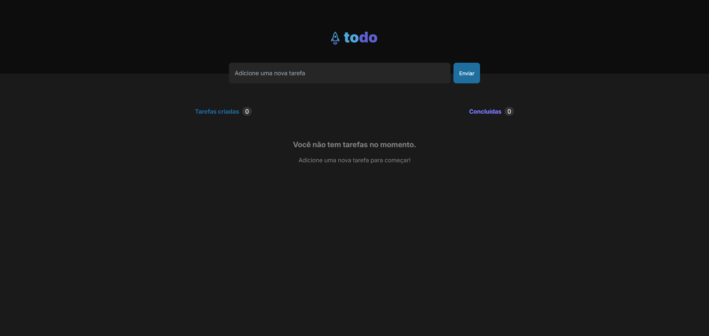

# ToDo Application

Uma aplicação simples de lista de tarefas (To-Do) desenvolvida com **React.js** e estilizada com **Tailwind CSS**. 
Este projeto permite criar, marcar como concluídas e excluir tarefas de forma intuitiva.

## 🖥️ Mockup

Abaixo está uma prévia visual do layout da aplicação:



## 🚀 Tecnologias Utilizadas

- **React.js**: Biblioteca JavaScript para construção de interfaces de usuário.
- **Tailwind CSS**: Framework de estilização para criar interfaces modernas e responsivas.
- **React Icons**: Biblioteca para incorporar ícones facilmente.

## ⚙️ Funcionalidades

- Adicionar novas tarefas.
- Marcar tarefas como concluídas.
- Excluir tarefas da lista.
- Exibição de uma mensagem amigável quando não há tarefas cadastradas.

## 🛠️ Como Rodar o Projeto

1. Clone este repositório:
   ```bash
   git clone https://github.com/seu-usuario/seu-repositorio.git
   ```

2. Acesse a pasta do projeto:
   ```bash
   cd seu-repositorio
   ```

3. Instale as dependências:
   ```bash
   npm install
   ```

4. Inicie o servidor de desenvolvimento:
   ```bash
   npm start
   ```

5. Acesse a aplicação no navegador:
   ```
   http://localhost:3000
   ```

## 📂 Estrutura do Projeto

```plaintext
/src
├── components
│   ├── Header
│   │   └── Header.jsx   # Cabeçalho com logo
│   ├── Search
│   │   └── Search.jsx   # Campo de busca e botão para adicionar tarefas
│   └── Tasks
│       └── Tasks.jsx    # Gerenciamento de tarefas (exibir, concluir, excluir)
├── App.jsx              # Componente principal
├── main.jsx             # Configuração inicial do React
└── global.css           # Estilização global
```

## ✨ Layout Responsivo

A aplicação foi desenvolvida para se adaptar a diferentes tamanhos de tela, oferecendo uma experiência consistente em dispositivos móveis, tablets e desktops.

## 🧑‍💻 Contribuições

Contribuições são sempre bem-vindas! Sinta-se à vontade para abrir uma [issue](https://github.com/seu-usuario/seu-repositorio/issues) ou enviar um [pull request](https://github.com/seu-usuario/seu-repositorio/pulls).

## 📝 Licença

Este projeto está licenciado sob a **MIT License**. Consulte o arquivo LICENSE para mais informações.
